## Markdown Nice新特性

- 支持阿里云OSS作为自定义图床
- 需要配置四个选项，分别为region、accessKeyId、accessKeySecret、bucket
- 使用阿里云会有相应的费用，请参考阿里云官网

`https://cn.aliyun.com/product/oss`

## 配置步骤

### 获取region和bucket

打开阿里云控制台，选择对象存储，点击加号添加 Bucket，如下图所示

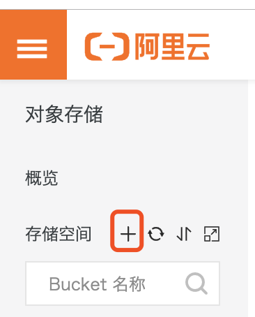

填入相关信息，其中Bucket名称即为需要填入的Bucket值，Endpoint前面那段即为需要填入的Origin值，也就是区域来源，如下图所示：

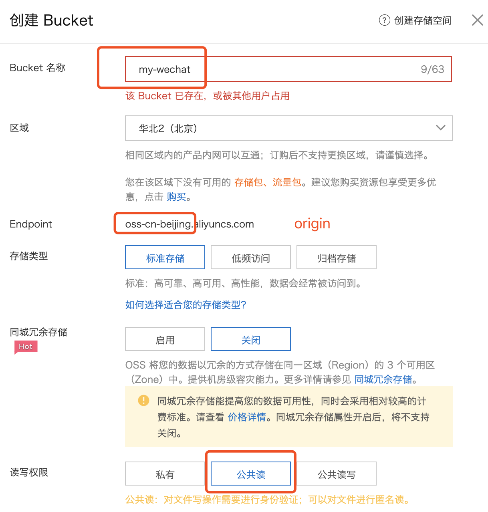

填完后点击确认创建Bucket成功。

### 获取AccessKey ID和AccessKey Secret

首先去右上角个人头像那里，点击accesskeys，如图所示：

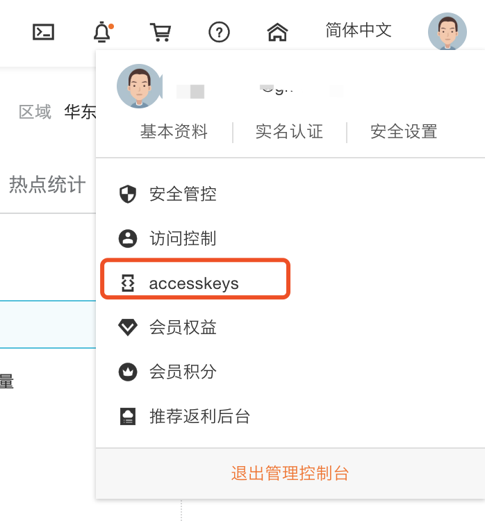

点击后会被通知目前的accesskey是拥有个人所有云产品的权限，也就是如果这个accesskey泄露会导致你在阿里云购买的所有产品都不安全，所以我们点击**开始使用字用户AccessKey**，使用只拥有OSS权限的accesskey。

首先建立子账户，如下图所示：

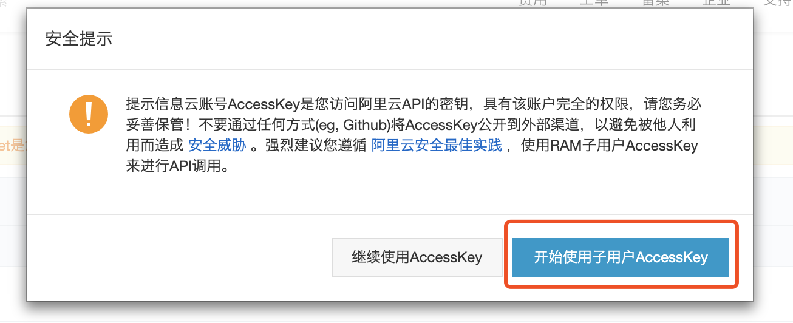

填入子账户登录名称，勾选**编程访问**（勿忘），如下图所示：

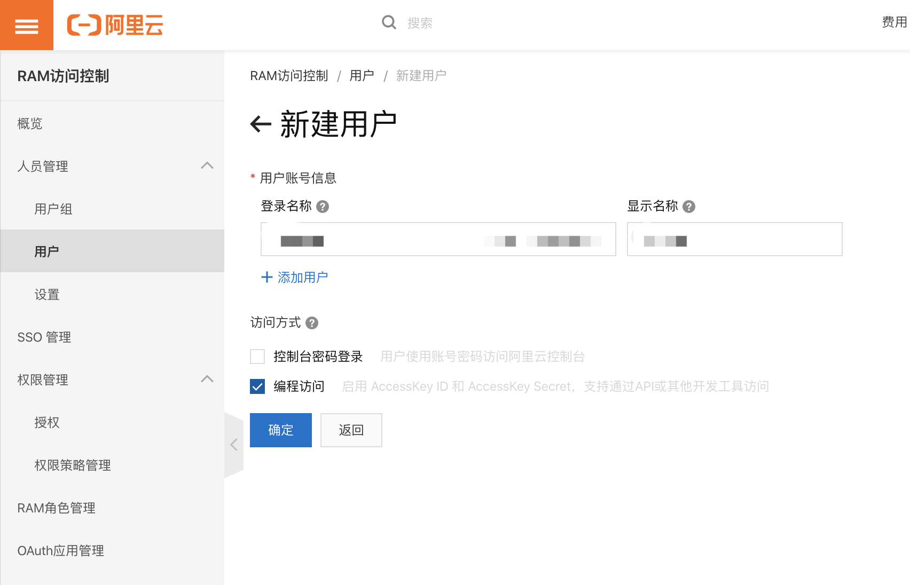

建立成功后即可见到AccessKey ID和AccessKey Secret了，图床中配置这两个即可，如下图所示：

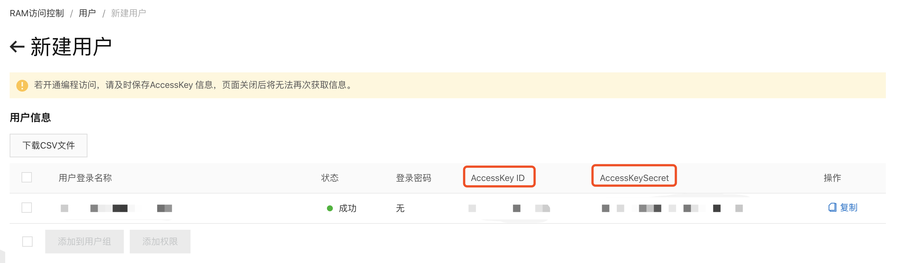

### 添加权限

尽管获取到了所有值，但是我们目前子用户还无法使用，因为未授予对象存储OSS权限，所以我们需要找到用户->添加权限，如下图所示：

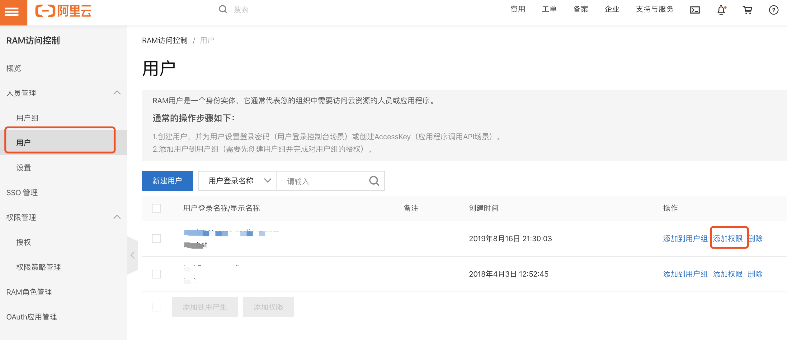

选择AliyunOSSFullAccess这个权限，确定即可，如下图所示：

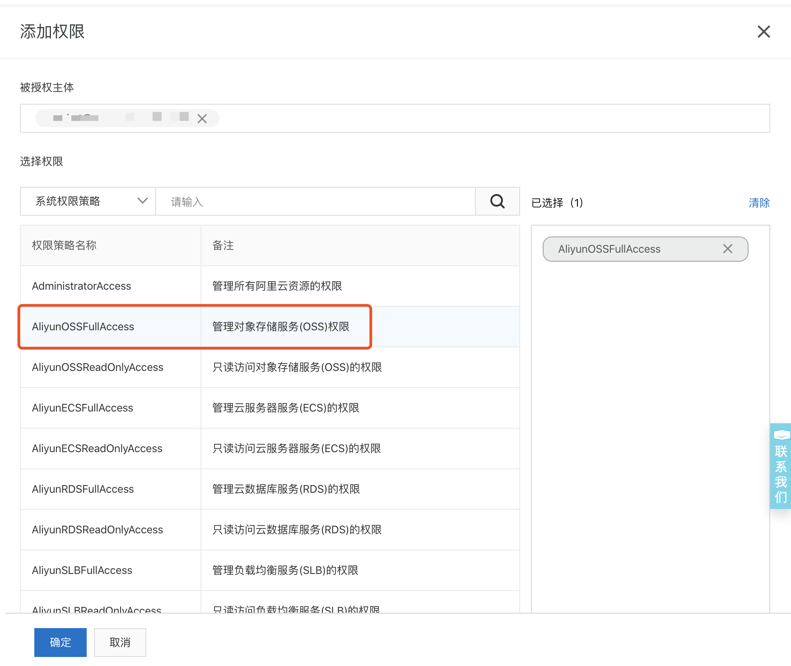

到目前为止我们还差最后一步，因为mdnice是前端应用，不接入后台，所以上述信息均保存在本地不会被泄露，但也导致了跨域请求问题，故而我们需要设置允许跨域。

### 跨域设置

如果不设置跨域允许，则在浏览器控制台上会有报错，如下图所示：

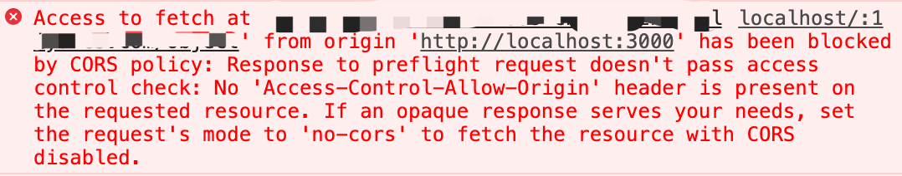

我们回到创建的Bucket，点击基础设置，找到跨域设置，点击设置按钮，如下图所示：

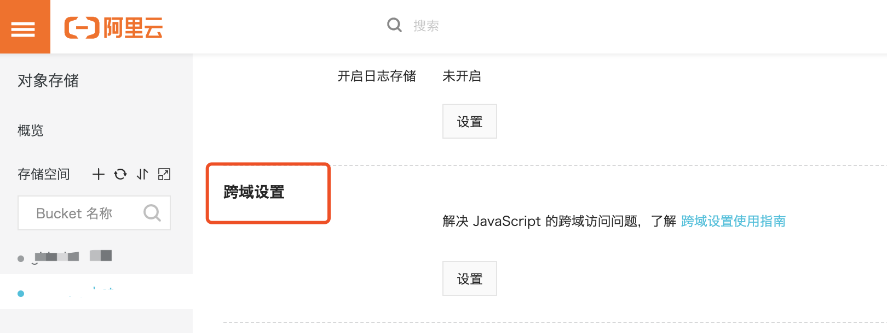

进入后点击创建规则，需要填写三项内容：

- 来源：https://mdnice.com
- 允许Methods：GET和PUT
- 允许Headers：*

可参考下图

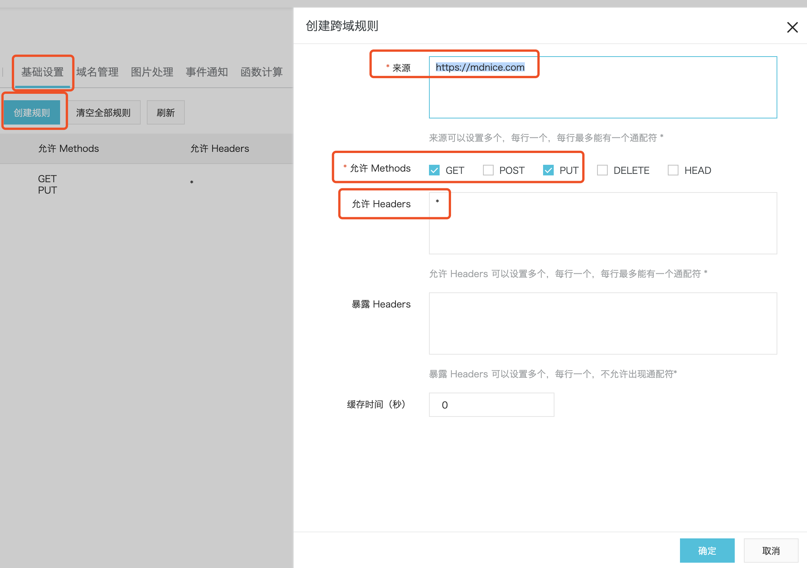

## 总结

如果不出意外，上述都配置正确，就可以在Markdown Nice上正常使用阿里云图床了，速度不是一般的快，体验不是一般的好，**粘贴微信图片失败率大幅度降低**！

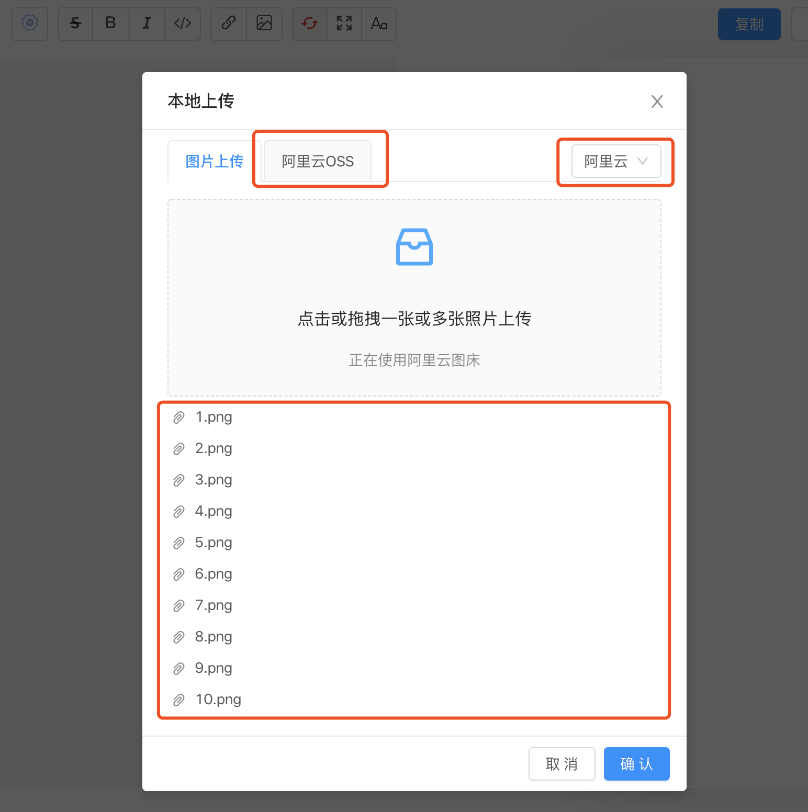

如上图所示，记得先配置阿里云OSS中的四个值，再点击右上角切换阿里云，即可同时上传多张图片了！