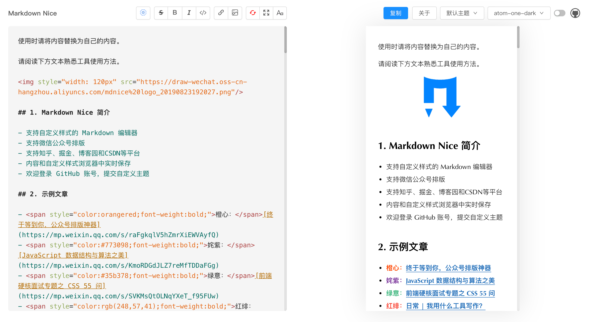
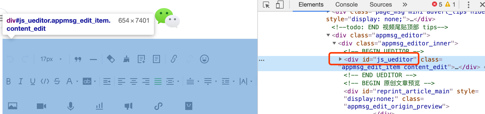
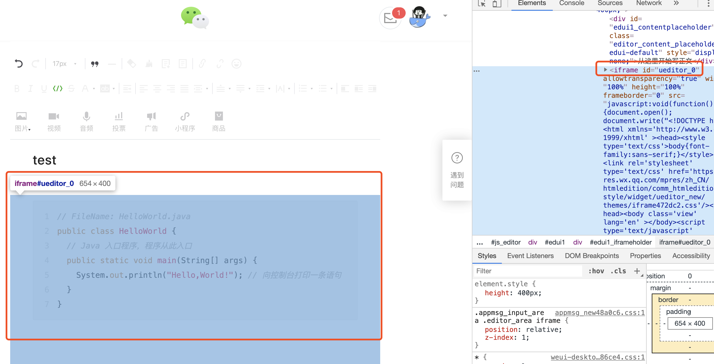
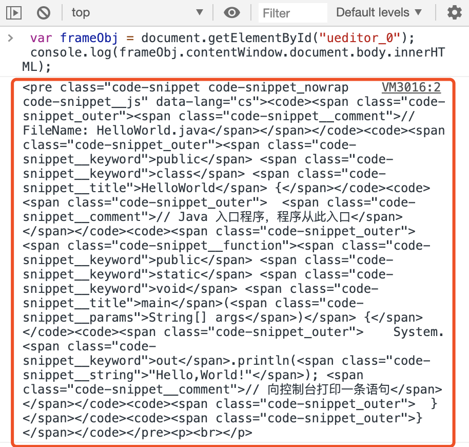
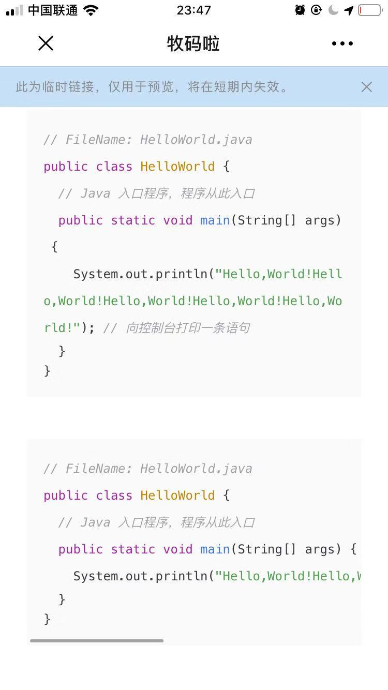
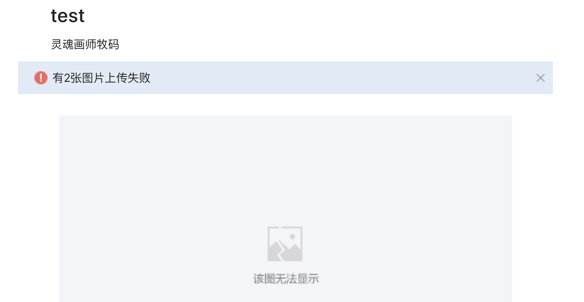
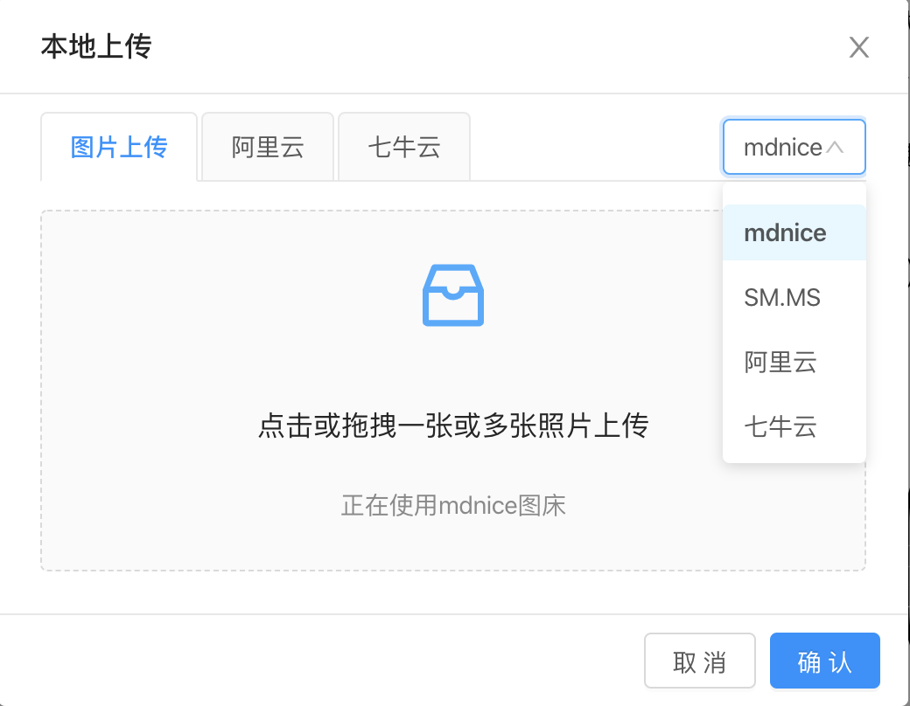
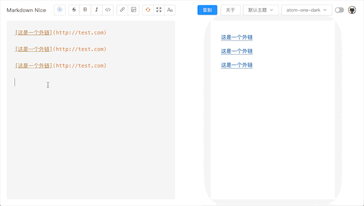

# 和微信公众号编辑器战斗的日子

> 本文提到的 Markdown Nice 体验地址：**https://mdnice.com**

公元2019年，微信公众号排版能力孱弱，始终为运营者所诟病，秀米、135编辑器等工具割据一方。

但无论是微信原生工具，还是其他编辑器，都让创作者不得不将有限的创作经历分散到排版设计上。

> **Markdown**，解决排版的灵丹妙药，应运而生。

## 引子

### Markdown是什么？

Markdown 是一种排版语法，拥有极简的输入方式和极低的学习成本。

富含了标题、引用、加粗、链接、图片、代码段、公式等一切在文字创作中需要的排版格式。

> 拥有它，让人专注于内容本身，而不被格式所打扰。


### 怎么和微信公众号结合？

这么优秀的排版语法，可是微信公众号也不支持呀。

> **别急！Markdown Nice来帮你解决问题！**

### Markdown Nice是什么？

一款开源 Markdown 编辑器，写完后即排版成功，复制即可粘贴到微信公众号。

**So what？ 只有这点么？**

**当然不是！Nice宝宝你还有什么特性呀？** 


- 支持图床、脚注、代码、公式
- 支持 8 种排版主题和 7 种代码主题
- 支持自定义样式，可提交主题供人瞻仰
- 除了公众号外，还支持知乎、掘金、博客园和CSDN等平台
- **我颜值高呀**



这么多优秀的特性摆在你面前，还在等什么？

地址：`https://mdnice.com`

**快让你的微信排版 Nice 起来！**

## 正文

~~没想到你还在看~~

咳咳、、、

不要小看Nice宝宝我，为了能够使用 Markdown 进行公众号排版，我可是和微信公众号编辑器做了半年的斗争，才赢得了现在的战果！


想听听我是如何战斗的？下面且听我娓娓道来！

### 战斗序章

微信公众号编辑器源于百度 FEX 前端团队的开源的 [ueditor](http://ueditor.baidu.com "ueditor") 项目，这可是宝宝我扒取了网页代码发现的，如图所示：



因为 ueditor 是富文本编辑器，所以我即将面临的是 `markdown->富文本` 的转换战役，在开源界或者软件界这种转换战役有了相当多的优秀实现。比如：

- Web端：[editor.md](https://github.com/pandao/editor.md "editor.md")、[mavonEditor](https://github.com/hinesboy/mavonEditor "mavonEditor")
- PC端：[typora](https://typora.io/ "typora")、[MWeb](https://zh.mweb.im/ "MWeb")

但是上述工具都存在一个问题，没有很好地将 **CSS 样式**融入富文本中，进而适配微信编辑器，以至于国内其他各大平台的富文本编辑器。

那么有没有尝试弥补这一问题的工具呢？其实是有的：

- Web端：[md2all](http://md.aclickall.com/ "md2all")、[wechat-format](https://github.com/lyricat/wechat-format "wechat-format")
- 浏览器插件：[markdown-here](https://markdown-here.com/ "markdown-here")

> 但是上述工具也各自有不完美的地方，于是Nice宝宝我发现了这个契机，把自己生产了出来，解决一切不完美！

Markdown Nice 是一个开源项目，由很多开源技术合体而成，其中主要包括：

- [React](https://github.com/facebook/react "React")：facebook 开源的 js 视图层框架
- [markdown-it](https://github.com/markdown-it/markdown-it "markdown-it")：markdown 转换富文本解析器
- [juice](https://github.com/Automattic/juice "juice")：将 CSS 类选择器转换为行内样式的工具
- [codemirror](https://github.com/codemirror/codemirror "codemirror")：网页代码编辑器
- [ant-design](https://github.com/ant-design/ant-design "ant-design")：React UI组件库
- [mobx](https://github.com/mobxjs/mobx "mobx")：状态管理库
- [highlight.js](https://github.com/highlightjs/highlight.js "highlight.js")：代码高亮库
- [MathJax-node](https://github.com/mathjax/MathJax-node "MathJax-node")：公式转图片库
- axios、ali-oss、qiniu-js等

注：下文会提到上述某些开源库，开源库具体作用请参考此处。

在拥有上述技术傍身之后，我向微信编辑器宣战，打响了战斗第一枪！


### 战斗第一枪：代码主题

微信公众号在2018年以前，是完全不支持代码块的，目前的支持也很单一，并且存在代码字体较大的问题。

> 说来很气，微信公众号编辑器的开发者，就木有想过**代码块对程序员群体是多么重要么**？？


为此我找来了`highlight.js`代码高亮神器，帮助解决代码主题单一的问题。

经过一定的筛选后，最终选定了 atom-one-dark, atom-one-light, monikai, github, vs2015, xcode 和微信代码主题共 7 个代码样式供大家选择。

其中微信代码主题由于其不属于`highlight.js`的归属范畴，故而其结构需要从微信公众号编辑器源码中获取，下面两张图展示了如何获取：





而 `highlight.js` 与 `markdown-it` 解析器是关联使用的，故而工具中存在 2 个 markdown 解析器，分别用于解析微信代码主题和其他代码主题，[源码参考](https://github.com/zhning12/markdown-nice/blob/master/src/utils/helper.js#L55-L133 "源码参考")。

除了上述问题外，很多技术类公众号代码中会存在：**一行代码过长导致的多行显示问题**。

该问题使用以下 CSS 代码即可解决：

```css
pre code {
  display: -webkit-box !important
}
```

对比效果如图所示：



从此以后使用 Markdown Nice 的同志们代码更美观啦！

### 战斗第二枪：图片上传

一篇好的文章怎么可以没有图片？

（某些技术人员说：我的就没有）


> 图片管理是每一个成熟编辑器都会遇到的问题。

Nice宝宝最开始使用 [SM.MS](https://sm.ms/ "SM.MS") 图床，该图床由一位大佬在运维，非常感谢！

使用该图床虽然能够上传图片，但是粘贴到微信编辑器时，失败率极高（**想踩死微信编辑器**），如图所示：



真是{喜闻乐见|hē hē hē hē}呀！

为了解决上述问题，Markdown Nice 先后支持了自定义阿里云和七牛云图床，通过购买阿里云和七牛云的服务使用自建图床。

**但是！让使用者自己配置，尽管有配置文档，但是整个配置过程复杂无比，简直惨绝人寰！**


于是，Nice宝宝又使用自己的账号，自建图床，设定保存时间为一天，提供临时排版使用的 mdnice 图床。至此，工具中的图片上传支持情况如下：

|图床|费用|有效期|失败率|
|---|---|---|---|
|mdnice|免费|1天|低|
|SM.MS|免费|长期|高|
|阿里云|[参考](https://cn.aliyun.com/product/oss "参考")|自定义|低|
|七牛云|10G免费|自定义|低|



这场图床的战役中，最大的难度在于需要阅读阿里云 OSS 和七牛云 KODO 的文档，并且使用其开源出来的工具包 ali-oss 和 qiniu-js 。

这其中又涉及到了 FormData、file对象、base64 和 blob 之间的神奇转换，[源码参考](https://github.com/zhning12/markdown-nice/blob/master/src/component/Dialog/ImageDialog.js "源码参考")。

总之，这场战斗打的不亦乐乎。

### 战斗第三枪：数学公式

**微信公众号排版中，数学公式是一个噩梦！**

因为微信编辑器做了以下三件事情：

- 不支持公式编辑
- 不支持 html 和 css 生成的公式，因为字体无法导入
- 不支持带`<defs>`标签的svg，放入后提示失败

> 这三件事情简直像魔鬼的步伐，把公式需求者放在光滑的地板上摩擦、摩擦....


经过探索，发现微信公众号支持不带`<defs>`标签的svg，于是将使用mathjax即可完成生成公式的svg的工作

### 战斗第四枪：微信外链转脚注

众所周知（不知道也得知道），微信不支持外链，除了域名为`https://mp.weixin.qq.com/`的合法链接外，其他的链接出现后都会被自动删除。

而添加外链的唯一官方方式就是在阅读全文处，当然，直接将链接本身放到文中或者制作二维码图片也是可以的选择。

**而Nice宝宝则提供了将微信外链转为脚注的方式解决该问题，是不是很优雅呢？**


其中链接和脚注的使用区别如下：

```markdown
链接：[文字](链接 "文字")
脚注：[文字](脚注解释 "脚注名字")
```

这里又涉及到了一个常见的问题，就是很多公众号作者的文章中，原来在其他平台发布时都是链接，而到这里排版时需要进行挨个修改，实在是让人头大。


于是Nice宝宝我又做了一个小改进，就是在粘贴文章的时候会自动监测是否存在外链，并提示作者是否一键转成脚注，这样就不必手工修改了，赞不赞！



### 战役总结

和微信公众号编辑器对抗，是个极其有意思的过程。除了上述提到的问题之外，还有很多的细节点需要注意，在此就不一一讨论了，感兴趣欢迎阅读源码。

> Markdown Nice 的战斗之旅还远远没有结束，官网制作、浏览器插件、本地工具和排版纠正等功能蓄势待发。

## 谈点和战斗无关的

### 设计理念

**大多数人而言，内容重于排版，排版重于设计。**

内容是吸引读者的核心，所以最重要。

而排版与设计之间的比较，作为一个曾经的微信美术编辑，随着排版经验的增多，发现文章的效果并不在于额外的花边、点缀。

> **整齐、舒服、简单是硬道理!**

### 内容、排版与设计

**设计 = 排版 + 创意**
 
---

因为：大多数人不会获取创意，或认为创意成本过高。

所以：大多数人不做设计，富文本设计不适合单纯的内容编辑者。

---

虽然：大多数人也不会排版，或认为排版成本过高。

但是：**Markdown Nice 将用户从排版中释放出来，只关注内容本身。**

### 关于开源

开源是个既简单又困难的过程：

- **说简单是因为**：笔记、书单、工具、平台所有有价值的东西都可以在 GitHub 中输出，做起来很简单
- **说困难是因为**：努力做到对别人有价值，始终坚持输出，做起来很困难

正如上面描述的那样，做开源其实是在做一款产品，有可能是技术产品（比如 redis、ant design），也有可能是业务产品（比如 Markdown Nice），只有做好了才可能对别人产生价值。

做产品的过程曲折而漫长，对照 Markdown Nice 开发过程，可以看到以下的步骤：

1. 要有一个 idea，并且验证其可行性和必要性，去和同类产品比较，做到心中有数
2. 抓住痛点，掌握核心价值，站在用户角度思考，多听反馈意见
3. 螺旋上升，不断迭代，产出精品
4. 最最重要一点，**做产品不只要写代码，还要宣传呀！！酒香也怕巷子深！！**

参与开源，一路走来，甚是不易，望君珍惜。

> 最后，感谢每一位开源参与者，欢迎更多人参与到开源中来，还有好多代码等着有人来写呢！


