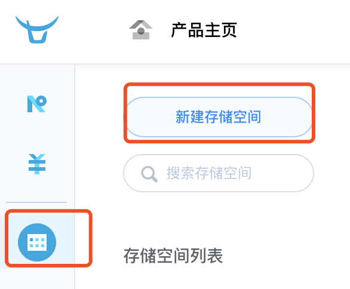
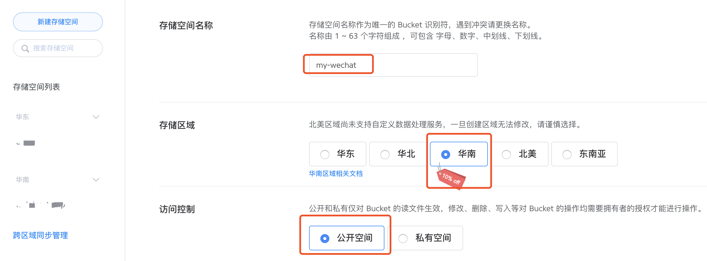
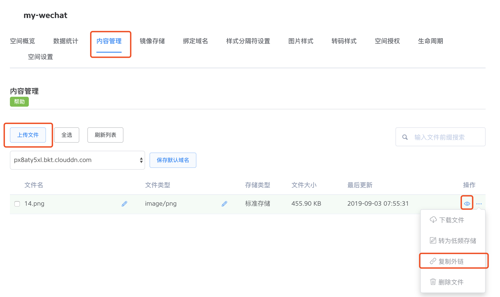
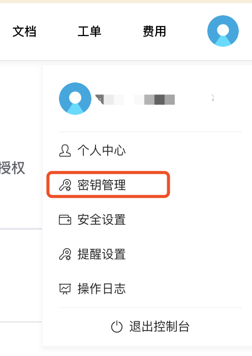
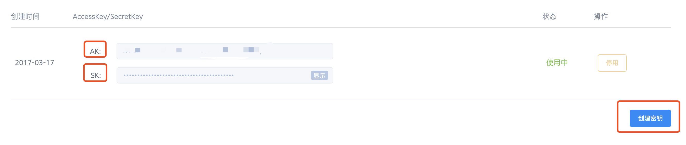
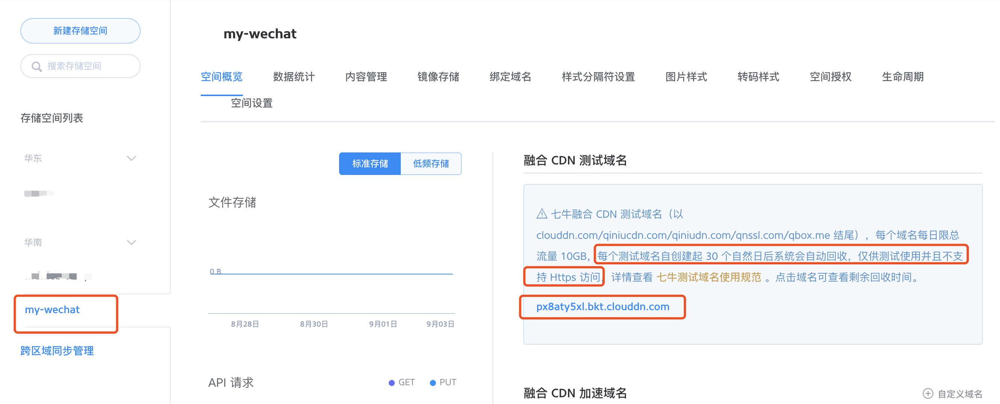
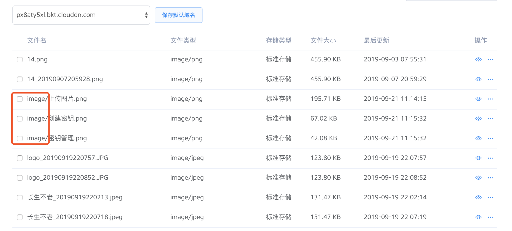
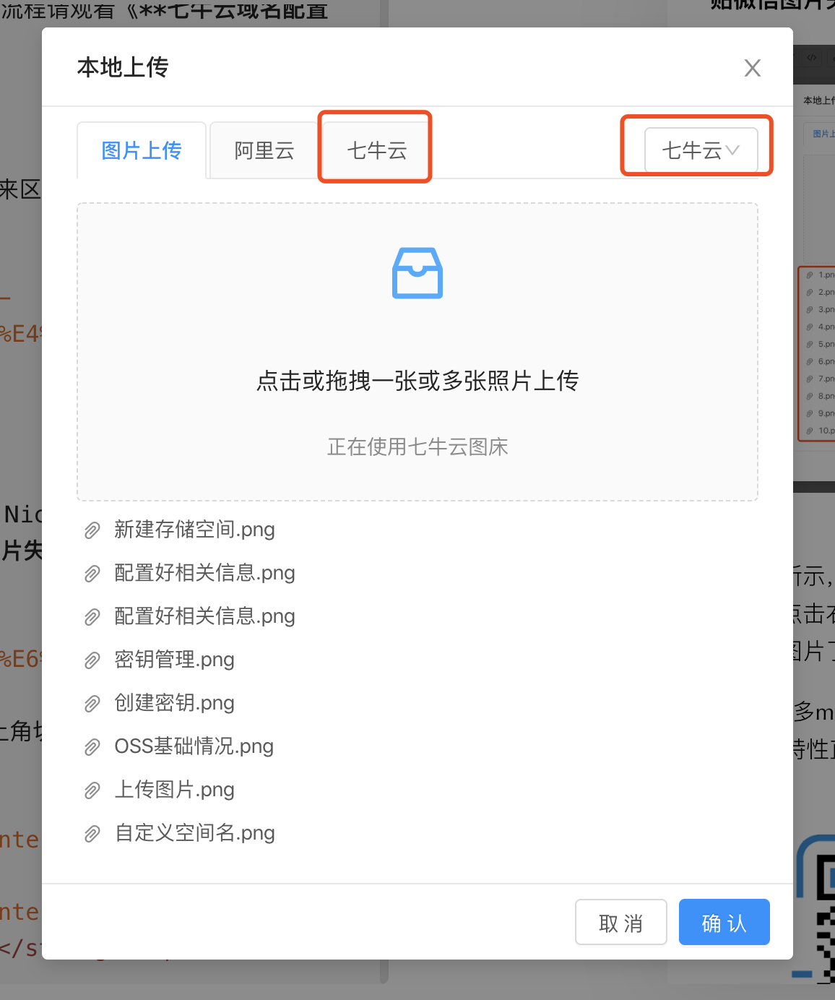

## Markdown Nice新特性

- 支持七牛云KODO作为自定义图床
- 需要配置六个选项，分别为：

|字段名|填写|
|---|---|
|存储空间名称|**必填**|
|存储区域|**必填**|
|AccessKey|**必填**|
|SecretKey|**必填**|
|自定义域名|**必填**|
|自定义命名空间|选填|

- 使用七牛云会有 10GB 免费空间，超出后会产生相应的费用，请参考七牛云官网

`https://www.qiniu.com/products/kodo`

## 配置步骤

### 获取 存储空间名称 和 存储区域

打开七牛云控制台，选择对象存储，点击新建存储空间，如下图所示：

填入相关信息，其中**存储空间名称**和**存储区域**即为我们需要的值，同时要将访问控制设置为**公开空间**，如下图所示：

填完后点击确认创建存储空间成功，可以去内容管理处上传一张图片测试一下。

### 获取AccessKey和SecretKey

首先去右上角个人头像那里，点击秘钥管理，如图所示：

点击后查看当前是否有可用秘钥，如果没有点击右下角创建秘钥，建立成功后即可见到AccessKey和SecretKey了，图床中配置这两个即可，如下图所示：

### 获取自定义域名

点击新建的存储空间名，可以在空间概览中看到其测试域名，注意测试域名都是**http协议**的，如图所示：

> 注意：测试域名只能使用30天，过期后域名失效，**之前使用该域名的图片也会失效**，如果想要长期使用需要购买域名并进行配置，配置流程请观看《**七牛云域名配置**》文章

### 自定义空间名

自定义空间名是一个选填项，填写后可以通过路径前缀来区分文件，比如填写`image/`后，如图所示：

## 总结

如果不出意外，上述都配置正确，就可以在Markdown Nice上正常使用七牛云图床了，速度不是一般的快，体验不是一般的好，**粘贴微信图片失败率大幅度降低**！

如上图所示，记得先配置七牛云中的6个值，再点击右上角切换七牛云，即可同时上传多张图片了！